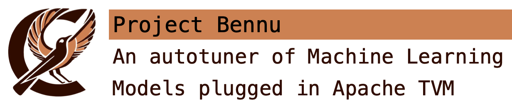

# Bennu

   

## Introduction

TODO

## Building 

From Bennu, It's not necessary to build the project. But, It depends on some 
dependencies from other projects to work that might be necessary to build.

### Dependencies

These are the most important dependencies for running Bennu:

| Dependency | Version   | Installation Link                                    |
|------------|-----------|------------------------------------------------------|
| TVM        | >= 0.13   | [TVM website](https://tvm.apache.org/docs/index.html)|
| Python3    | >= 3.6.0  | [Python website](https://www.python.org)             |

## Running

To run the code, execute the script `bennu/scripts/run_ansor.sh` to generate 
Ansor's template for a specific machine architecture. Default is x86-32.
The script `bennu/scripts/test_build_template.sh` executes 100 templates using 
Droplet Search as an optimizer of the Ansor's template.
