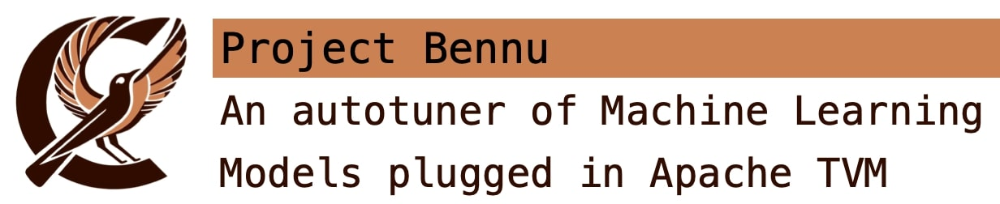

# Bennu

<p align="center">
  </br>
</p>

## Introduction

The goal of this project is to combine
[Ansor](https://tvm.apache.org/2021/03/03/intro-auto-scheduler) and
[AutoTVM](https://tvm.apache.org/docs/reference/api/python/autotvm.html).
We want to use Ansor to do some exploration of kernel configurations,
and then use AutoTVM to exploit the best solution found by Ansor.

## Building 

From Bennu, It's not necessary to build the project. But, It depends on some 
dependencies from other projects to work that might be necessary to build.

### Dependencies

These are the most important dependencies for running Bennu:

| Dependency | Version   | Installation Link                                    |
|------------|-----------|------------------------------------------------------|
| TVM        | >= 0.13   | [TVM website](https://tvm.apache.org/docs/index.html)|
| Python3    | >= 3.6.0  | [Python website](https://www.python.org)             |

## Running python models

Generating the Ansor template with 10k trials for a specific machine architecture.

```
  python3 benchmarks/mm.py -m ansor -a x86 -l results/x86_mm.json
```

Optimize Ansor template using Droplet Search with 100 trials:

```
  python3 benchmarks/mm.py -m droplet -a x86 -l results/x86_mm.json -t 100
```

## Running ONNX models

Generating the Ansor template with 10k trials for a specific machine architecture.

```
python3 benchmarks/models_onnx.py -m ansor -a x86 -t 10000 -l results/x86_resnet18_10k.json -b models/resnet18.onnx
```

Optimize Ansor template using Droplet Search with 100 trials:

```
python3 benchmarks/models_onnx.py -m droplet -a x86 -t 100 -l results/x86_resnet18_10k.json -b models/resnet18.onnx
```